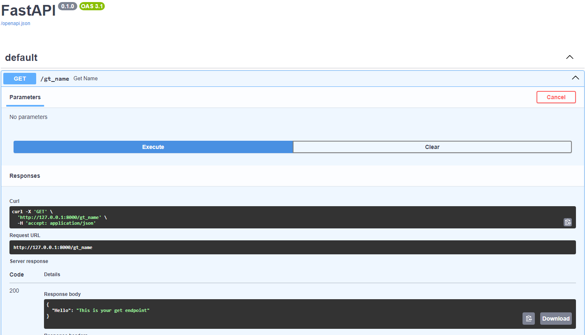
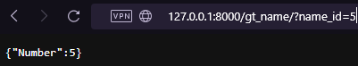

# AsynchIO
## Návod na instalaci


# FastApi :runner:
## Návod na instalaci

:one: Vytvoření virtuálního prostředí
```
python -m venv venv
```

:two: Aktivace virtuálního prostředí, aby se nám všechny knihovny instalovali sem
```
venv\scripts\activate
```

:three: Nainstalování knihoven fastapi a uvicorn
```
pip install fastapi uvicorn[standard]
```

:four: Vytvoření python souboru a naimportování FastAPI
```
from fastapi import FastAPI

app = FastAPI()
```

### Spouštění aplikace
```
uvicorn {jmeno python souboru}:{jmeno FastAPI instance} --reload
```
V mém případě: 
```
uvicorn main:app --reload
```  
Naše aplikace beží na localhostu na adrese, kterou nám to vypsalo do konzole.

## Programování :computer:
Jakmile máme připravené pracovní prostředí, je čas programovat

Podíváme se na 4 základní endpointy
### Endpoint GET
Základní syntax endpointů
```
@app.get("/gt_name")
async def get_name():
    return {"Hello": "This is your get endpoint"}
```  
Teď, když se podíváme zpátky na náš localhost, tak by nám to mělo vypsat "Hello": "This is your get endpoint".  

Alternativně můžeme do URL za náší localhost adresu připsat /docs a objeví se nám swagger  


## Co je to SWAGGER
<details>
<summary> Swagger </summary>
    Dopřává nám možnost vizualizovat a interagovat s naší API bez toho, abychom si museli nejdřív naprogramovat nějakou logiku.  
    Automaticky to generuje prostředí podle našich OpenAPI specifikací
    Víc informací [zde](https://github.com/swagger-api/swagger-ui/blob/master/README.md)
</details>  
  

Po kliknutí vpravo na "Try it out" a poté dole na "Execute" se nám zavolá ten samý endpoint, jako přes URL.  
Momentálně je jedno, přes co si to budete žkoušet.  
  
**Zpátky k GET**  

FastAPI používá tzv "Path and Querry parametrs"

**1. Path parametrs:** pracujeme s daty, které jsou součástí URL adresy.  
```
@app.get("/gt_name/{name}")
async def get_name(name):
    return {"Hello": name}
```

Teď, když si to vyzkoušíme, tak náš výstup by mohl vypadat takto:


Ale i takto


Nebo takto


Neřekli jsme FastAPI, jaký datový typ požadujeme, tak to všechno konvertuje na typ string.  
Kdybychom chtěli zadávat jenom hodnoty typu int, tak než to dělat přes složitou podmínku ve funkci, tak využijeme funkci FastAPI,
která to dělá sama

```
@app.get("/gt_name/{name_id}")
async def get_name(name_id: int):
    return {"Number": name_id}
```
Následný output je už int:  


Jinak bychom dostali tuto krásnou chybovou hlášku od knihovny pydantic, o které se dozvíme zachvíli.
```
{"detail":[{"type":"int_parsing","loc":["path","name"],  
"msg":"Input should be a valid integer,  
unable to parse string as an integer","input":"pepa","url":"https://errors.pydantic.dev/2.6/v/int_parsing"}]}
```
   
--------------------------------------------------------------------------
<details>
<summary> ÚKOL </summary>
Pod tento endpoint si zkopírujte tento:  

```python
@app.get("/gt_name/5")
async def get_name():
    return {"Number": "Vymysli si něco"}
```

Jaký return to vrátí?
Proč nám to nevypíše {"Number": "Vymysli si něco"}?
>[!WARNING]
> Záleží na pořadí endpointů ve scriptu. Ten, co je dřív si ten požadavek vezme a zpracuje.
</details>
--------------------------------------------------------------------------     

**2. Querry parametrs:** Pracujeme s daty, které nám přijdou z tzv "body"
```
@app.get("/gt_name/")
async def get_name(name_id: int):
    return {"Number": name_id}
```

Samozřejmě můžeme kombinovat Path a Querry parametrs nebo jich napsat několik
```
@app.put("/names/{name_id}")
async def update_name(name_id: int, name: str, user: User):
```  
Pro naše testování můžeme použít 2 způsoby poslání dat:  
Data pošleme buď pomomocí napsání do URL:  
  
Nebo přes swagger  

### Endpoint POST
Skrz body nám přijde string 'name' a ten přidáme do db

Nad náš get endpoint si přidáme falešnou db, kterou budeme testovat naše endpointy:
```
fake_names_db = [
    "Elon Muskrat",
    "Johnny Depp-ression",
    "Taylor Drift",
    "Brad Pitstop",
    "Angelina Joliet",
    "Kim Carcrashian",
    "Leonardo DiCapuccino",
    "Miley Virus",
    "Beyoncé Knows-all",
    "Dwayne 'The pebble' Johnson"
]
```
  
Syntax na endpoint post
```
@app.post("/ps_name/")
async def create_name(name: string):
    fake_names_db.append(name)
    return {"message": "Item added successfully"}
```  

### Endpoint PUT
Skrz body nám přijde int 'name_id' a string 'name'. Podle intu přepíšeme požadovaný text v db
```
@app.put("/pt_name/")
async def update_item(name_id: int, name: str):
    fake_names_db[name_id] = name
    return {"message": "Item updated successfully"}
```  

### Endpoint DELETE
Skrz body nám přijde int 'name_id'. Podle intu odstraníme požadovaný text v db
```
@app.delete("/del_name/")
async def update_item(name_id: int):
    del fake_names_db[name_id]
    return {"message": "Item deleted successfully"}
```
  
## Pydantic

Pydantic používá tzv. BaseModely
BaseModel 
    -> třída, podle které fastapi (pydantic) ověřuje, že data přišla celá a ve správných typech. (Nenapsali jsme "text" do typu int)
    -> můžeme tím nahradit spoustu validací v querry parametrs jedním BaseModel
  
```
from pydantic import BaseModel, PositiveInt

class Name(BaseModel):
    name: str  
    people_with_name: PositiveInt | None = None
```  

Přepíšeme náš kód, aby využíval BaseModely

```
from fastapi import FastAPI, HTTPException
from pydantic import BaseModel, PositiveInt, EmailStr

app = FastAPI()

fake_names_db = [
    {"name": "Elon Tusk", "people_with_name": 3, "email": "elon.tusk@email.com"},
    {"name": "Johnny Depp-ression", "people_with_name": 2, "email": "johnny.deppression@email.com"},
    {"name": "Taylor Drift", "people_with_name": 1, "email": "taylor.drift@email.com"},
    {"name": "Brad Pitstop", "people_with_name": 2, "email": "brad.pitstop@email.com"},
    {"name": "Angelina Joliet", "people_with_name": 1, "email": "angelina.joliet@email.com"},
    {"name": "Kim Carcrashian", "people_with_name": 2, "email": "kim.carcrashian@email.com"},
    {"name": "Leonardo DiCapuccino", "people_with_name": 3, "email": "leonardo.dicapuccino@email.com"},
    {"name": "Ariana Grande Latte", "people_with_name": 2, "email": "ariana.grande.latte@email.com"},
    {"name": "Dwayne John Jonah Johnson", "people_with_name": 3, "email": "dwayne.john.jonah.johnson@email.com"}
]

class Name(BaseModel):
    name: str  
    people_with_name: PositiveInt | None = None

@app.get("/names/")
async def get_names():
    return fake_names_db

@app.get("/name/{name_id}")
async def get_item(name_id: int):
    return fake_names_db[name_id]

@app.post("/ps_name/")
async def create_name(name: Name):
    fake_names_db.append(name.model_dump(dict))
    return {"message": "Name created successfully"}

@app.put("/pt_name/")
async def update_item(name_id: int, name: Name):
    fake_names_db[name_id] = name.model_dump(dict)
    return {"message": "Name updated successfully"}

@app.delete("/dl_name/")
async def delete_item(name_id: int):
    fake_names_db.remove(fake_names_db[name_id])
    return {"message": "Name deleted successfully."}
```  
Z pydantic jsem si naimportoval PositiveInt a EmailStr.  
PositiveInt: čísla budou kladná  
EmailStr: řetězec bude mít podobu emailu  

Zde jsou další příklady:  
SecretBytes: pro hesla (***)  
List: pouze formát listu  
URL: formát URL  

## Připojení na databázi

### Instalace
```
pip install sqlalchemy
```

Naimportování potřebných knihoven

```
from sqlalchemy import Column, Integer, String, DateTime, Enum, MetaData, func, create_engine, inspect
from sqlalchemy.orm import relationship, declarative_base
```

Vytvoření tabulky

```
Base = declarative_base()

class NameTable(Base):
	__tablename__ = 'nameTable'
	id = Column(Integer, primary_key=True, autoincrement=True)
    name = Column(String(25))
```
