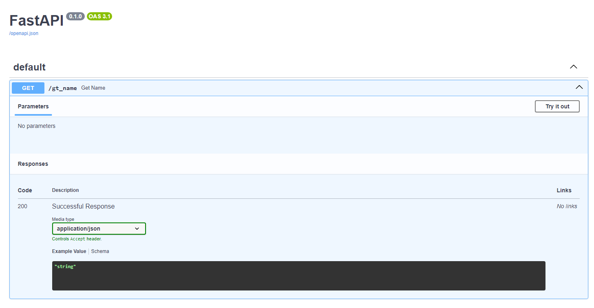
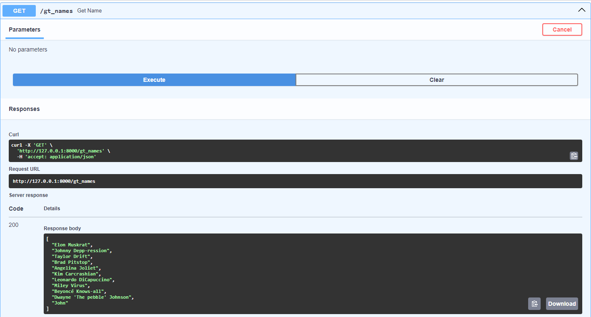
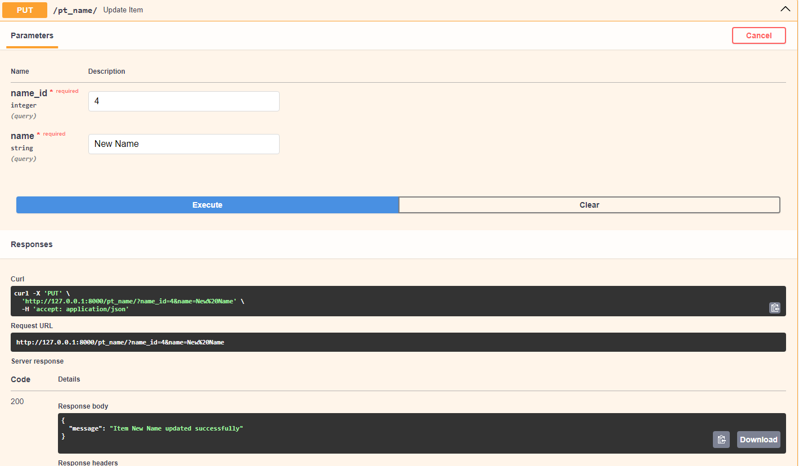
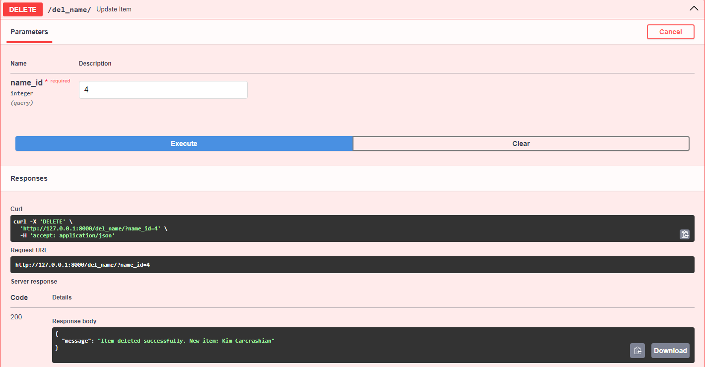

# Návod na instalaci  

:one: Vytvoření virtuálního prostředí
```
python -m venv venv
```

:two: Aktivace virtuálního prostředí, aby se nám všechny knihovny instalovali sem
```
venv\scripts\activate
```

:three: Nainstalování knihoven fastapi a uvicorn
```
pip install fastapi uvicorn[standard]
```

:four: Vytvoření python souboru a naimportování FastAPI
```
from fastapi import FastAPI

app = FastAPI()
```

# Spouštění aplikace
```
uvicorn {jmeno python souboru}:{jmeno FastAPI instance} --reload
```
V mém případě: 
```
uvicorn main:app --reload
```  
Naše aplikace beží na localhostu na adrese, kterou nám to vypsalo do konzole.  

Alternativně můžeme do URL za náší localhost adresu připsat /docs a objeví se nám swaggerUI.  

## Co je to SWAGGERUI  
Dopřává nám možnost vizualizovat a interagovat s naší API bez toho, abychom si museli nejdřív naprogramovat nějakou logiku.  
Automaticky to generuje prostředí podle našich OpenAPI specifikací  
Víc informací [zde](https://github.com/swagger-api/swagger-ui/blob/master/README.md)  
 
  

# Základní Endpointy  
Ještě než začneme, tak API většinou komunikuje s nějakou databází. Abychom si mohli řádně ukázat práci s API, využieme knihovnu SQLAlchemy a db SQLite
```  
from sqlalchemy import Column, Integer, String, DateTime, Enum, MetaData, func, create_engine, inspect
from sqlalchemy.orm import relationship, declarative_base
```  

class Name(Base):
    __tablename__ = 'zakaznik'
    
    id = Column(Integer, primary_key=True, autoincrement=True)
    jmeno = Column(String(25))
    prijmeni = Column(String(25))
    vek = Column(Integer(3))
    
    kontakt = relationship("Zakaznik_kontakt")
    adresa = relationship("Zakaznik_adresa")
    

Base = declarative_base()

engine = create_engine('sqlite:///:memory:')
Base.metadata.create_all(engine)  # Vytvoření tabulek

Session = sessionmaker(bind=engine)
## GET endpoint  
```
@app.get("/")
async def get():
    return {"message": "Hello World"}
```  
Spustíme aplikaci. Podíváme do prohlížeče na URL adresu, kterou nám to napsalo v konzoli.  
```
{"message": "Hello World"}
```  
Teď si nakonec Path v URL připíšeme /docs a otevře se nám SwaggerUI, kde to samé můžeme vyzkoušet.  
  
## POST endpoint  
```
@app.post("/")
async def create_name(name: str):
    return {"message": f"Item {name} added successfully"}
```  

Pro vizuální otestování si přidáme do applikace "databázi" a upravíme si endpointy.  
```
fake_names_db = [
    "Elon Muskrat",
    "Johnny Depp-ression",
    "Taylor Drift",
    "Brad Pitstop",
    "Angelina Joliet",
    "Kim Carcrashian",
    "Leonardo DiCapuccino",
    "Miley Virus",
    "Beyoncé Knows-all",
    "Dwayne 'The pebble' Johnson"
]

@app.post("/cr_name")
async def create_name(name: str):
    fake_names_db.append(name)
    return {"message": f"Item added successfully"}

@app.get("/gt_name")
async def get_name():
    return fake_names_db
```

A otestujeme, jestli se nám povedlo přidat něco do "databáze"
Web

SwaggerUI: 
 
## PUT endpoint  
U endpointu PUT už potřebujeme parametry 2. Jeden identifikátor a druhý, čím to chceme nahradit
```
@app.put("/pt_name/")
async def update_item(name_id: int, name: str):
    fake_names_db[name_id] = name
    return {"message": f"Item {fake_names_db[name_id]} updated successfully"}
```  
Můžeme otestovat buď skrz web  

nebo přes SwaggerUI  

## DELETE endpoint
A poslední základné endpoint je nečekaně na mazání záznamu. Tady už potřebujeme akorát identifikátor
```
@app.delete("/del_name/")
async def update_item(name_id: int):
    del fake_names_db[name_id]
    return {"message": "Item deleted successfully"}
```  
Zase můžeme otestovat buď skrz web  

nebo přes SwaggerUI  

# Path a Query parametry
Jak už jsme si mohli všimnout, FastAPI používá nějakou formu parametrů / proměnných. Přesněji se dělí na Path a Query.  
## Path
Deklarují se přímo v Path pomocí {} a jako parametr ve funkci.  
A jak je zvykem proměnných, můžeme s nimi dále pracovat
```
@app.get("/gt_name/{name}")
async def get_name(name):
    return {"Hello": name}
``` 
Teď, když si to vyzkoušíme, tak náš výstup by mohl vypadat takto:


Ale i takto


Nebo takto


Důvod je, že jsme neřekli FastAPI, jaký datový typ požadujeme. Tak se s tím FastAPI nijak netrápí a všechno konvertuje na typ string.  
Typ proměnné určíme v parametrech funkce pomocí **proměnná: "typ"**

```
@app.get("/gt_name/{name_id}")
async def get_name(name_id: int):
    return {"Number": name_id}
```
Následný output už bude int:  


### Ukoly na Path
1) Zkuste místo čísla vložit nějaký řetězec. Co se stane?
<details>
<summary> Vysvětlení </summary>

Jak víme, lidi jsou hloupý a s velkou pravděpodobností zkusí zadat jinou než numerickou hodnotu. Díky knihovně Pydantic (o kterém se dozvíme víc později) se o to nemusíme moc starat. Pokud to půjde, tak to zkusí překonvertovat, pokud ne, tak místo toho, aby nám aplikace spadla, tak nám vypíše chybovou hlášku:  
```
{"detail":[{"type":"int_parsing","loc":["path","name"],  
"msg":"Input should be a valid integer,  
unable to parse string as an integer","input":"pepa","url":"https://errors.pydantic.dev/2.6/v/int_parsing"}]}
```
</details>

2) Zkuste si pozměnit GET endpoint aby PATH parametr byl typu string a vypsat ji.
Co se stane, když tam zadám numerickou hodnotu? A co když zadám datum?
> [!TIP]
> typ string se určí **proměnná: str**  

<details>
<summary> Vysvětlení </summary>
Ano, chybouvou hlášku to nevypsalo. Páč FastAPI je založeno na kihovně Pydantic, která každou hodnotu překonvertuje na string
</details>

## Query 
U Path jsme psali hodnoty přímo do URL a FastAPI si je potom zpracovalo. U Query se data posílají přes tzv. "body".  
Proměnné se deklarují jen v () u funkce. Jakmile proměnná není součástí URL, je automaticky považována za Query proměnnou.  

```
@app.get("/gt_names/")
async def get_names(name_id: int):
    return {"Number": name_id}
```  
Query je pár klíč-hodnota v URL, která je za **?**.   
```
http://127.0.0.1:8000/gt_namse/?name_id=5
```  
Kdybychom jich měli definovaných více, oddělují se pomocí **&**  
```
@app.get("/gt_names/")
async def get_names(name_id: int, name: str):
return {"Number": name_id, "Name": name}
```
```
http://127.0.0.1:8000/gt_namse/?name_id=5&name=Venca
```  

Nebo můžeme testovat pomocí SwaggerUI  


Query proměnné můžeme nastavit defaultni hodnotu, nebo je dokonce nastavit na nepovinné

```
@app.get("/gt_names/")
async def get_name(name_id: int = 0, name: Union[str, None] = None)
return {"Number": name_id, "Name": name}
```
> [!NOTE]
> Od Pythonu 3.10 můžeme nepovinné proměnné definovat:
> name: str | None = None


Samozřejmě můžeme kombinovat Path a Querry parametrs nebo jich napsat několik

```
@app.put("/names/{name_id}")
async def update_name(name_id: int, name: str):
return {"Number": name_id, "Name": name}
```

Stejným způsobem můžeme deklarovat nepovinné parametry

```
@app.put("/names/{name_id}")
async def update_name(name_id: int, name: Union[str, None] = None):
return {"Number": name_id, "Name": name}
```
> [!TIP]
> Od Pythonu 3.10 můžeme i takto:
> ```
> name: str | None = None
> ```

Dále můžeme validovat data pomocí knihoven Query a Annotated, například:  
maximální/minimální délka proměnné  
přidávání metadat (popisků)  
Jestli se hodnota rovná přesně danné patterně
Aby to byl list, URL, soubor

Dají se validovat hodnoty typu string,int,..  

Úplně stejně můžeme validovat i proměnné v Path, akorát nebudeme importovat ~~Query~~, ale **Path**

### Ukoly na Query
1) Zkuste si definovat promennou typu bool. Napište si if podmínku na kontrolu True False + výpis.  
Zkuste zadávat všemožné obměny hodnot typu pravda (true, True, on, yes..)
<details>
<summary> Vysvětlení </summary>

```
@app.get("/names")
async def get_name(bl: bool = False):
    if bl:
        return "Hodnota překonvertována na True"
    else:
        return "Hodnota překonvertována na False"
```
Zase nám pomáha knihovna Pydantic a všechno konvertuje na hodnotu True  

</details>

# Pydantic 
Když potřebujeme poslat data do API tak je posíláme jako "request body". Api nám poté posílá "response body"  
Abychom mohli takové "request body" poslat, využijeme k tomu knihovnu Pydantic.  

Nejprve si naimportujeme pydantic s BaseModel
```
from pydantic import BaseModel
```
Teď si deklarujeme náš data model, která dedí z BaseModel
```
class Name(BaseModel):
    first_name: str
    last_name: Union[str, None] = None
    age: float
```
Tím, že jsme si vytvořili tento model jako třídu, tak už nemusíme všechno vypisovat jako query parametry.  
Proměnné, které nejsou definované jako nepovinné (Union[str, None] **= None**), jsou vždy <code style="color":red>povinné</code>
```
@app.get("/names/")
async def update_name(name: Name):
return name
```
Když si to teď vyzkoušíme v SwaggerUI, tak zjistíme, že nám to vrací JSON (respektivě dictionary)

### Ukoly na Pydantic

# Ukázka použití
